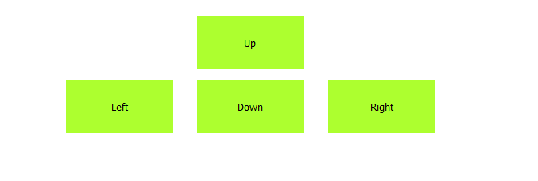

# WebInterfaceRPI
A Web Interface (with API included) for CamJamEdukit 3 for RPI Zero W

  
*Part of Web Interface used to control Robot*

### What's in here?
* An API made with Python 3.8
* An API made with Node.js if you prefer all Javascript
* A Frontend using vanilla JS, HTML & CSS

### Dependencies
* Python 3.8 and pip3 and/or latest version of Node.js and npm
* A Raspberry PI (only Python version for armv6l based RPIs) with Raspberry Pi OS installed
* CamJam Edukit 3 

### How to use
1. Make sure dependencies are installed (check by `python -v` or `node -v && npm -v`).
2. Open a terminal and `cd` into WebInterfaceAPI.
3. Run command `python3 -m http.server &`.
4. Then navigate into either the Node.js or Python version of the API.
5. Run the following commands dependent on your choice
    * If using Node.js version run `npm install` first and then `npm start &`.
    * If using Python version run `pip3 install flask` then `python3 api.py &`.
6. In your browser go to http://*hostname*:8000/ and replace *hostname* with your hostname (default is raspberrypi.local).

### How to stop
1. Run the command `ps`.
2. Find the two rows with python3 or node.js on them.
3. Note down the numbers in the rows and replace `*job*` below with them.
4. Run `kill *job*` twice with each number.
5. If you have multiple other Python/Node.js programs running, run `ps *job*` and check each one. If one of them has the commands you typed in earlier, you can kill it using `kill *job*`.

### Authors
* Varshith A

